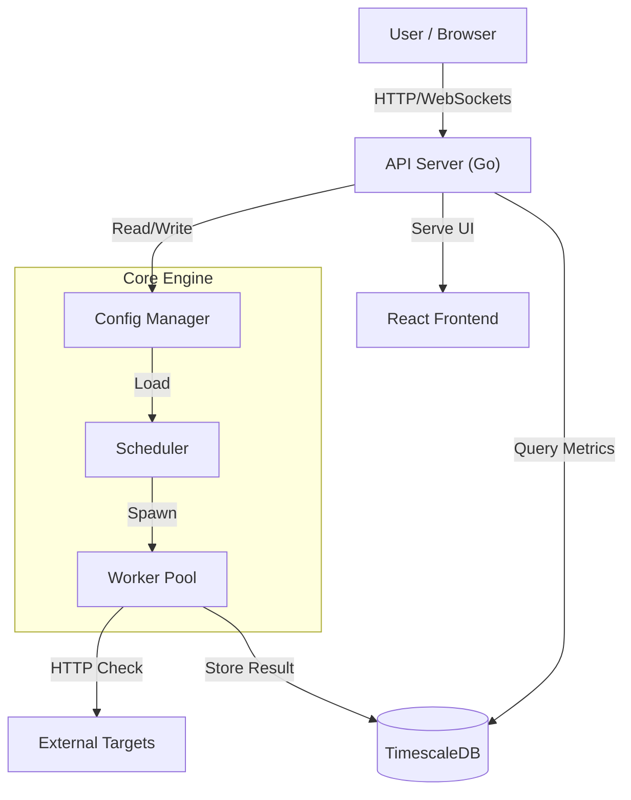
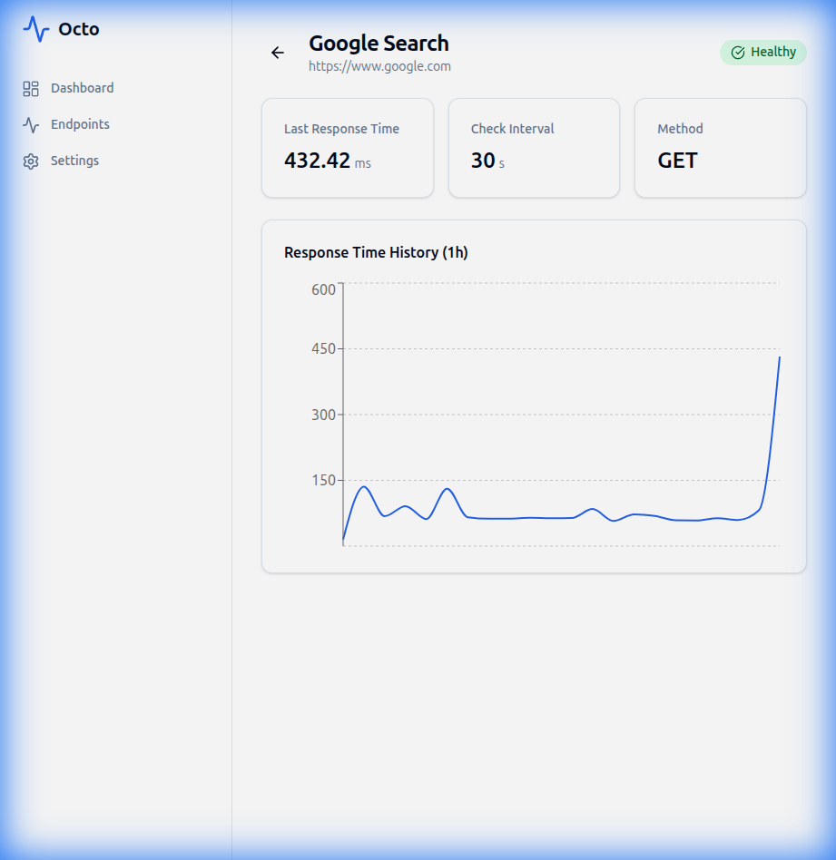
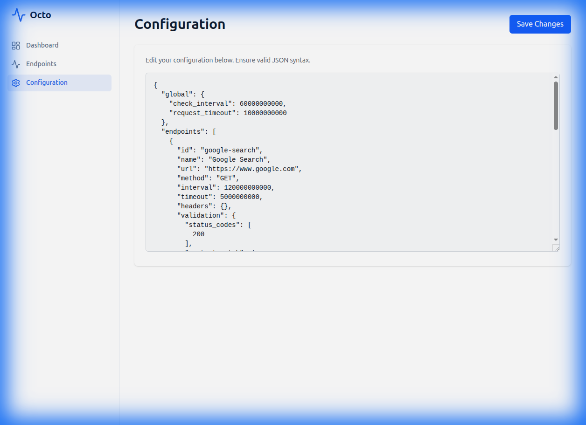

# 🐙 Octo
**The Intelligent, Distributed HTTP Monitoring Platform**


[](https://golang.org)
[](LICENSE)
[](Dockerfile)
[](#)

Octo is a modern, high-performance monitoring solution designed for developers and SREs who need reliability without the bloat. Built with **Go**, **React**, and **TimescaleDB**, Octo delivers real-time insights, historical analysis, and seamless configuration management in a lightweight package.

---

## 🚀 Key Features

*   **⚡ High-Performance Monitoring**: execute thousands of concurrent checks with minimal resource footprint.
*   **📊 Real-Time Dashboard**: Visualize uptime, latency, and health status instantly via a modern React UI.
*   **💾 Long-Term Storage**: Leverage **TimescaleDB** for powerful time-series queries and historical data retention.
*   **🛠️ Hot-Reload Configuration**: Update your monitoring targets on the fly via API or UI—no restarts required.
*   **🐳 Container Native**: Deploy effortlessly with Docker or Podman.
*   **🔍 Detailed Metrics**: Track everything—DNS resolution, TCP connection, TLS handshake, and TTFB.

---

## 🏗️ Architecture

Octo follows a clean, modular architecture separating the core monitoring engine from the storage and presentation layers.



---

## 📸 Screenshots

### Operational Dashboard
Get a bird's-eye view of all your services with real-time status indicators.


### Deep Dive Analytics
Analyze historical performance trends to identify latency spikes and outages.


### Seamless Configuration
Manage your endpoints directly from the browser with the built-in JSON editor.


### Seamless Configuration
Manage your endpoints directly from the browser with the built-in JSON editor.


---

## ⚙️ Configuration
Octo uses a YAML configuration file located at `config/config.yml`.

### Volume Mounting
When running with Docker or Podman, the local `config/` directory is mounted into the container at `/config`.
This means you can edit `config/config.yml` on your host machine, and the changes will be reflected in the container (requires restart for some changes, though hot-reload is supported for endpoints).

**Verified Mounting:**
- **run_podman.sh**: Mounts `$(pwd)/config:/config:Z`
- **docker-compose.yml**: Mounts `./config:/config`

**Note:** The `config.yml` file is NOT baked into the image. It is injected at runtime via the volume mount.

## 🗺️ Project Roadmap

| Version | Status | Features |
| :--- | :--- | :--- |
| **v0.1.0** | ✅ **Released** | MVP Core Engine, InfluxDB Support, Basic API |
| **v0.2.0** | ✅ **Released** | React Frontend, TimescaleDB Migration, Config UI, Historical Charts |
| **v0.3.0** | 🚧 **In Progress** | Alerting Engine (Slack/Email/PagerDuty), SLA Reporting |
| **v0.4.0** | 📅 **Planned** | User Authentication (OAuth2/OIDC), Multi-user Support |
| **v1.0.0** | 📅 **Future** | High Availability Clustering, Plugin System, Public Release |

---

## 🏁 Getting Started

### Prerequisites
*   **Docker** or **Podman**
*   **Go 1.22+** (only for manual builds)

### ⚡ Quick Start (Podman)
The fastest way to get up and running:

```bash
./scripts/run_podman.sh
```
Open **[http://localhost:8080](http://localhost:8080)** to start monitoring.

### 🐳 Quick Start (Docker Compose)
Standard deployment for Docker users:

```bash
docker-compose up -d --build
```

### 🔧 Manual Setup
For development or custom deployments:

1.  **Start Database**: Ensure TimescaleDB is running on `localhost:5432`.
2.  **Build & Run**:
    ```bash
    # Build Frontend
    cd web && npm install && npm run build && cd ..

    # Build Backend
    go build -o master cmd/master/main.go

    # Run
    ./master
    ```

---

## 📡 API Reference

Octo exposes a RESTful API for automation and integration.

*   `GET /health` - System health check
*   `GET /api/v1/config` - Retrieve current configuration
*   `POST /api/v1/config` - Update configuration (JSON)
*   `GET /api/v1/endpoints` - List all endpoints
*   `GET /api/v1/endpoints/{id}/history` - Retrieve historical metrics

---

<p align="center">
  Made with ❤️ by the Octo Team
</p>
