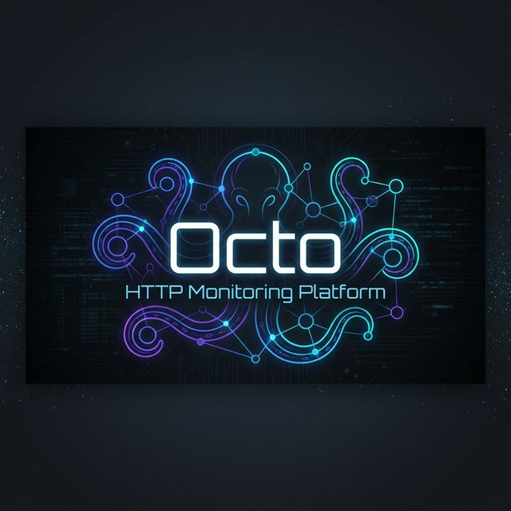
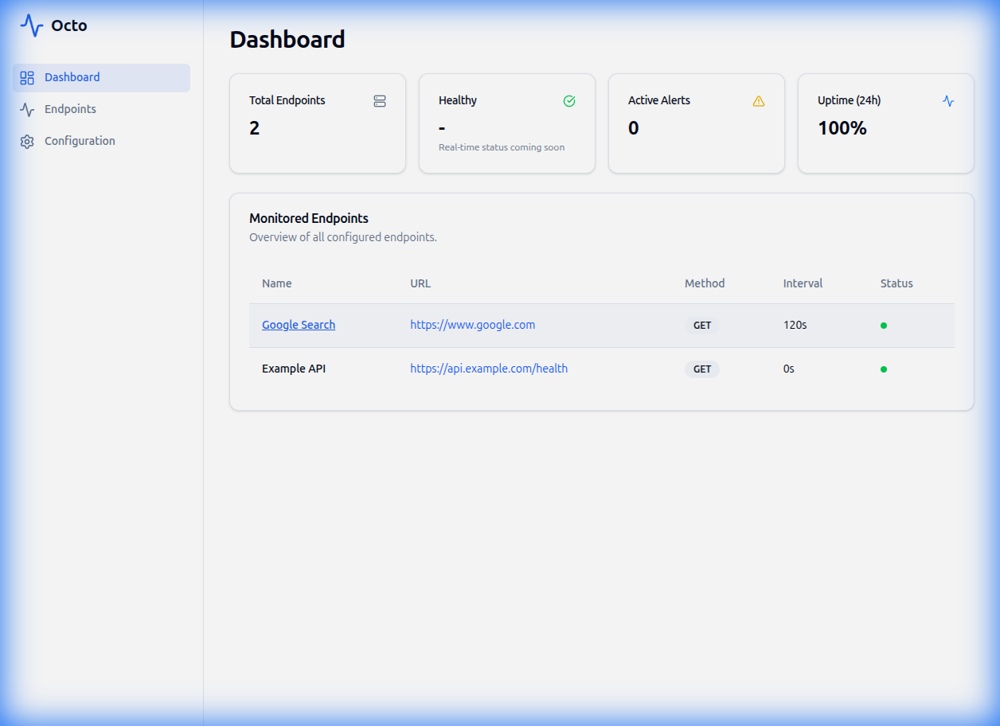
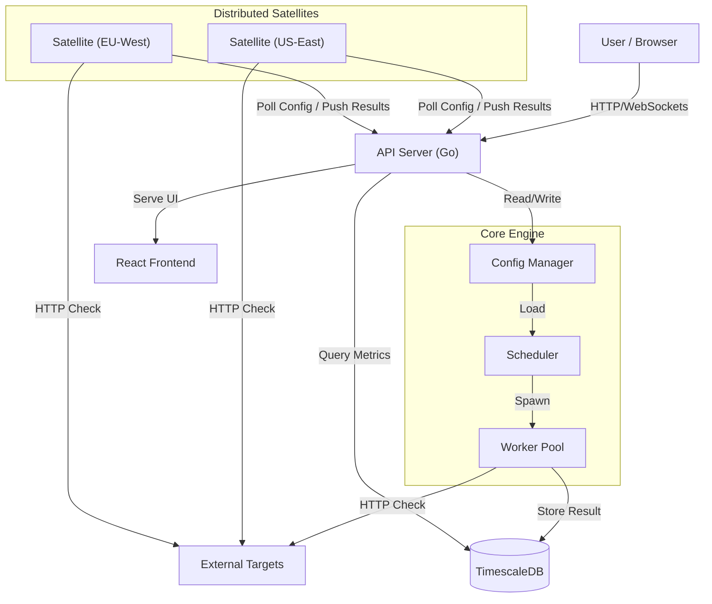

# 🐙 Octo
**The Intelligent, Distributed HTTP Monitoring Platform**



[](https://golang.org)
[](LICENSE)
[](Dockerfile)
[](#)

Octo is a modern, high-performance monitoring solution designed for developers and SREs who need reliability without the bloat. Built with **Go**, **React**, and **TimescaleDB**, Octo delivers real-time insights, historical analysis, and seamless configuration management in a lightweight package.

---

## 🚀 Key Features

*   **⚡ High-Performance Monitoring**: Execute thousands of concurrent checks with minimal resource footprint.
*   **📊 Real-Time Dashboard**: Visualize uptime, latency, and health status instantly via a modern React UI.
*   **🔒 SSL/TLS Monitoring**: Automatically track certificate expiration and get alerted before they expire.
*   **💾 Long-Term Storage**: Leverage **TimescaleDB** for powerful time-series queries and historical data retention.
*   **⚙️ UI-Based Configuration**: manage your endpoints directly from the browser with a full-featured editor.
*   **🚨 Alerting System**: Flexible alerting via Webhooks (Slack, Discord, PagerDuty) with tag-based routing.
*   **🛠️ Hot-Reload**: Update your monitoring targets on the fly via API or UI—no restarts required.
*   **🐳 Container Native**: Deploy effortlessly with Docker or Podman.
*   **🌍 Multi-Satellite Monitoring**: Run distributed checks from multiple geographic locations to verify global availability and latency.
*   **🤖 AI-Ready (MCP)**: Native integration with the Model Context Protocol (MCP) to allow AI agents to manage and query Octo.

---

## 🌍 Multi-Satellite Monitoring (New!)

Octo now supports **Distributed Monitoring** via Satellites. Deploy lightweight satellite nodes in different regions (e.g., AWS us-east-1, DigitalOcean fra1) to:
*   **Verify Global Availability**: Ensure your service is accessible from around the world.
*   **Monitor Latency**: Track response times from different geographic edge locations.
*   **Geo-Redundancy**: Avoid false positives caused by local network issues.

### Satellite Configuration
Easily assign endpoints to specific satellites via the configuration UI or YAML.


### Global Health View
See the status of your endpoints from every active satellite directly on the dashboard.


---

## 🤖 AI Integration via MCP

Octo is designed to be fully **AI-Friendly**. The master node comes with an embedded **Model Context Protocol (MCP)** server, making it trivial to connect your monitoring data directly into AI assistants like Claude Desktop, Cursor, and custom agentic workflows.

The MCP server runs on the same port as the Octo API via Server-Sent Events (SSE).

**Connection Details:**
*   **Endpoint:** `http://localhost:8080/api/v1/mcp/sse`
*   **Protocol:** SSE transport mapping to JSON-RPC messages

**Available AI Tools:**
*   `get_config`: Retrieve the deep metrics threshold and alerting configuration.
*   `list_endpoints`: Fetch real-time status and information on all monitored endpoints.
*   `list_satellites`: Get uptime and lifecycle metadata for all connected satellites.

**Why Use MCP?**
Instead of manually diagnosing an outage, your AI agent can query Octo to say *"Which endpoints are currently offline?"* or *"Compare the latency of api.example.com across all satellites."*

---

## 📸 Screenshots

### Operational Dashboard
Get a bird's-eye view of all your services with real-time status indicators.


### Deep Dive Analytics & SSL Info
Analyze historical performance trends, view SSL certificate details, and spot anomalies with synchronized charts.


### Endpoint Management
Effortlessly add, edit, and remove endpoints using the built-in configuration editor.


### Powerful Editor
Configure advanced settings like Request Headers, Validation Rules, and SSL Alerts with ease.


---

## 🏗️ Architecture

Octo follows a clean, modular architecture separating the core monitoring engine from the storage and presentation layers.



---

## ⚙️ Configuration
Octo uses a YAML configuration file located at `config/config.yml`.

### Volume Mounting
When running with Docker or Podman, the local `config/` directory is mounted into the container at `/config`.
This means you can edit `config/config.yml` on your host machine, and the changes will be reflected in the container (requires restart for some changes, though hot-reload is supported for endpoints).

**Note:** The `config.yml` file is NOT baked into the image. It is injected at runtime via the volume mount.

## 🗺️ Project Roadmap

| Version | Status | Features |
| :--- | :--- | :--- |
| **v0.1.0** | ✅ **Released** | MVP Core Engine, InfluxDB Support, Basic API |
| **v0.2.0** | ✅ **Released** | React Frontend, TimescaleDB Migration, Config UI, Historical Charts |
| **v0.3.0** | ✅ **Released** | Alerting Engine, SSL Monitoring, Config Editor, Aggregation Metrics |
| **v0.4.0** | 📅 **Planned** | User Authentication (OAuth2/OIDC), Multi-user Support |
| **v1.0.0** | 📅 **Future** | High Availability Clustering, Plugin System, Public Release |

---

## 🏁 Getting Started

### Prerequisites
*   **Docker** or **Podman**
*   **Go 1.22+** (only for manual builds)

### ⚡ Quick Start (Podman)
The fastest way to get up and running:

```bash
./scripts/run_podman.sh
```
Open **[http://localhost:8080](http://localhost:8080)** to start monitoring.

### 🐳 Quick Start (Docker Compose)
Standard deployment for Docker users:

```bash
docker-compose up -d --build
```

### 🔧 Manual Setup
For development or custom deployments:

1.  **Start Database**: Ensure TimescaleDB is running on `localhost:5432`.
2.  **Build & Run**:
    ```bash
    # Build Frontend
    cd web && npm install && npm run build && cd ..

    # Build Backend
    go build -o master cmd/master/main.go

    # Run
    ./master
    ```

---

## 📡 API Reference

Octo exposes a RESTful API for automation and integration.

*   `GET /health` - System health check
*   `GET /api/v1/config` - Retrieve current configuration
*   `POST /api/v1/config/endpoints` - Create new endpoint
*   `GET /api/v1/endpoints` - List all endpoints
*   `GET /api/v1/endpoints/{id}/history` - Retrieve historical metrics

---

<p align="center">
  Made with ❤️ by the Octo Team
</p>
